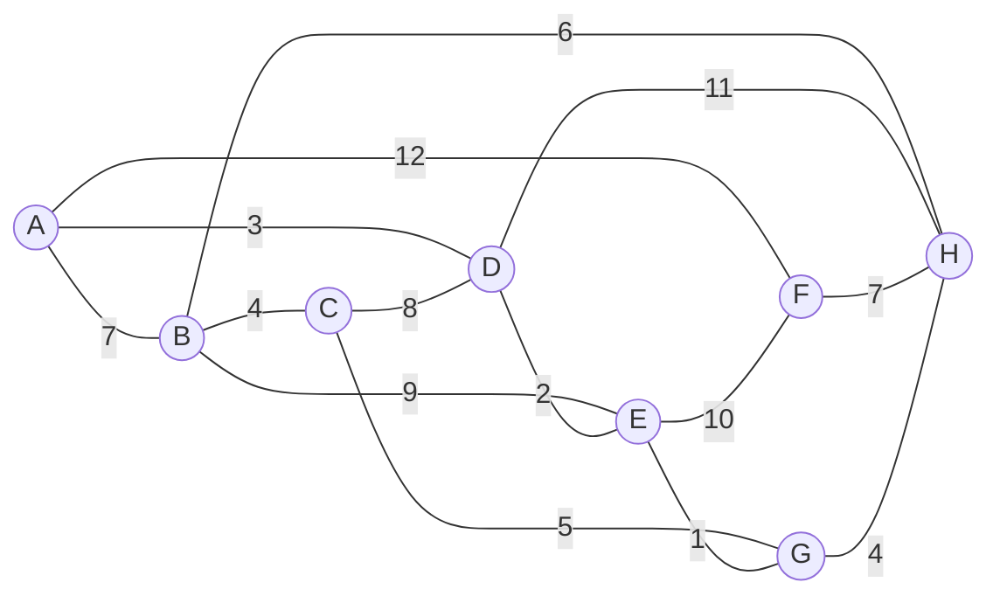

# Graph Visualization

Note: This graph is intended to be interpreted as undirected. Each edge represents a two-way connection with the same cost in both directions.

```mermaid
graph LR
    A((A))
    B((B))
    C((C))
    D((D))
    E((E))
    F((F))
    G((G))
    H((H))

    A ---|7| B
    A ---|3| D
    A ---|12| F
    B ---|4| C
    B ---|9| E
    B ---|6| H
    C ---|8| D
    C ---|5| G
    D ---|2| E
    D ---|11| H
    E ---|10| F
    E ---|1| G
    F ---|7| H
    G ---|4| H
```